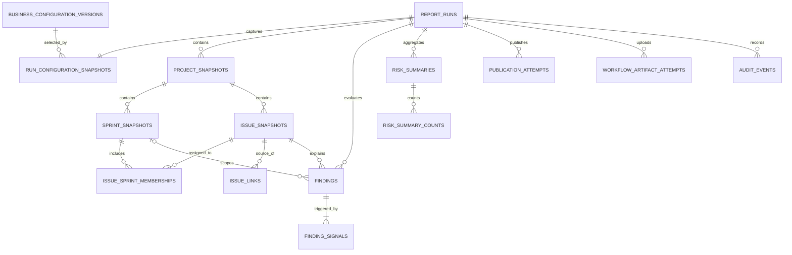

# Database Design

**Status:** T1.1 schema design
**Database:** PostgreSQL 15
**Governing documents:** `spec/constitution.md`, `spec/specification.md` v1.1.0, and `spec/architecture-decisions.md`
**Scope:** Logical schema only. Migration SQL and repository implementation belong to T1.2 and T1.3.

## Design Principles

- Store immutable, normalized Jira snapshots per report run so historical reports can be reproduced after Jira or configuration changes.
- Use PostgreSQL `uuid` primary keys for application entities, Jira identifiers as text, snake_case database names, and UTC `timestamptz` for instants.
- Store report-period boundaries as dates together with the IANA reporting timezone; business-setting snapshots must contain no secrets.
- Keep pipeline run state, destination publication attempts, and GitHub workflow-artifact attempts separate.
- Keep nullable Jira data nullable. Missing data must not be replaced with fabricated values.
- Do not retain raw Jira payloads, comments, credentials, or unnecessary personal data by default.
- Use restrictive foreign keys between a report run and its snapshots/findings to protect report history. Retention deletion order is specified in T1.5.

## Entity Relationships

## Tables

### `report_runs`

One row represents one scheduled or manual execution attempt.

| Column | Type | Notes |
| --- | --- | --- |
| `id` | `uuid` | Primary key, generated by PostgreSQL. |
| `idempotency_key` | `text` | Required; unique across run requests. Scheduled invocations use a generated deterministic key. |
| `scope_key` | `text` | Canonical scope representation with project keys sorted and optional sprint scope normalized. |
| `requested_scope` | `jsonb` | Original validated project and optional sprint selection. |
| `trigger_type` | `text` | `Scheduled` or `Manual`. |
| `created_by` | `text` | Nullable actor identifier; null for scheduled runs and while application identity is deferred. |
| `report_period_start`, `report_period_end` | `date` | Reporting-period date boundaries. |
| `report_timezone` | `text` | IANA timezone used to interpret the period. |
| `status` | `text` | Check-constrained to `Queued`, `Running`, `Completed`, `Completed with delivery warnings`, or `Failed`. |
| `current_stage` | `text` | Nullable pipeline progress stage. |
| `correlation_id` | `text` | Request/run correlation identifier. |
| `error_code` | `text` | Nullable sanitized terminal error code. |
| `created_at`, `started_at`, `completed_at` | `timestamptz` | `created_at` required; other lifecycle instants nullable. |

Constraints: unique `idempotency_key`; a partial unique index on `(scope_key, report_period_start, report_period_end)` where status is `Queued` or `Running`. This prevents concurrent equivalent runs while retaining completed/failed attempts as history. A repeat with the same idempotency key returns the existing run.

### `business_configuration_versions`

Immutable versions of database-managed, non-secret business settings.

| Column | Type | Notes |
| --- | --- | --- |
| `version` | `bigint` | Primary key, monotonically increasing. |
| `settings` | `jsonb` | Validated thresholds, mappings, lookback, retention, and destination enablement; secrets are forbidden. |
| `changed_by` | `text` | Nullable actor identifier until application identity is implemented. |
| `changed_fields` | `text[]` | Field names only, no old/new secret values. |
| `created_at` | `timestamptz` | UTC. |

### `run_configuration_snapshots`

Exactly one effective configuration snapshot for each report run.

| Column | Type | Notes |
| --- | --- | --- |
| `report_run_id` | `uuid` | Primary key and restrictive foreign key to `report_runs`. |
| `configuration_version` | `bigint` | Nullable foreign key to `business_configuration_versions` for the source version. |
| `effective_settings` | `jsonb` | Complete non-secret settings used by the run, including deployment defaults needed to explain its behavior. |
| `settings_hash` | `text` | Digest of canonicalized effective settings for integrity checks. |
| `created_at` | `timestamptz` | UTC. |

### `project_snapshots`

A project as observed during a specific run; the same Jira project has a new snapshot in later runs.

| Column | Type | Notes |
| --- | --- | --- |
| `id` | `uuid` | Primary key. |
| `report_run_id` | `uuid` | Restrictive foreign key to `report_runs`. |
| `project_key` | `text` | Jira project key, for example `KAN` or `SAM1`. |
| `name` | `text` | Jira display name when available. |
| `source_url` | `text` | Sanitized stable project URL. |
| `captured_at` | `timestamptz` | UTC snapshot time. |

Constraint: unique `(report_run_id, project_key)`.

### `sprint_snapshots`

| Column | Type | Notes |
| --- | --- | --- |
| `id` | `uuid` | Primary key. |
| `report_run_id`, `project_key` | matching project snapshot key | Composite restrictive foreign key to `project_snapshots`. |
| `jira_sprint_id` | `text` | Jira identifier stored as text to avoid upstream type assumptions. |
| `name` | `text` | Sprint name. |
| `state` | `text` | Normalized Jira sprint state. |
| `start_at`, `end_at`, `completed_at` | `timestamptz` | Nullable UTC instants from Jira. |

Constraint: unique `(report_run_id, project_key, jira_sprint_id)`.

### `issue_snapshots`

One normalized issue observation per report run.

| Column | Type | Notes |
| --- | --- | --- |
| `id` | `uuid` | Primary key. |
| `report_run_id`, `project_key` | matching project snapshot key | Composite restrictive foreign key to `project_snapshots`. |
| `jira_issue_key` | `text` | Jira issue key; unique within the report run. |
| `summary` | `text` | Issue summary, subject to privacy minimization. |
| `issue_type`, `status_name`, `status_category`, `priority_name` | `text` | Normalized fields; nullable when unavailable. |
| `assignee_account_id`, `assignee_display_name` | `text` | Nullable; store only fields needed for reporting. |
| `reporter_account_id`, `reporter_display_name` | `text` | Nullable; store only fields needed for participation filtering. |
| `due_date` | `date` | Nullable date-only Jira due date. |
| `created_at`, `updated_at`, `resolved_at` | `timestamptz` | Nullable UTC instants. Missing `updated_at` remains null and is handled as a run validation failure by the domain pipeline. |
| `original_estimate_seconds`, `remaining_estimate_seconds` | `bigint` | Nullable Jira time estimates; do not reinterpret as story points. |
| `story_points` | `numeric(12, 3)` | Nullable raw numeric value pending confirmation of the Jira field and unit. |
| `labels` | `text[]` | Optional sanitized labels needed by rules. |
| `source_url` | `text` | Stable Jira issue URL. |

Constraints: unique `(report_run_id, jira_issue_key)` and restrictive composite project foreign key.

### `issue_sprint_memberships`

Many-to-many relationship because an issue may retain sprint membership/history across multiple sprints.

Primary key: `(report_run_id, issue_snapshot_id, sprint_snapshot_id)`. Both snapshot references are restrictive and must belong to the same report run.

### `issue_links`

Stores normalized dependency/link direction without requiring every linked issue to be in the selected project snapshot.

| Column | Type | Notes |
| --- | --- | --- |
| `id` | `uuid` | Primary key. |
| `report_run_id` | `uuid` | Restrictive foreign key to `report_runs`. |
| `jira_link_id` | `text` | Upstream link identifier. |
| `source_issue_id` | `uuid` | Restrictive foreign key to the source issue snapshot. |
| `target_issue_id` | `uuid` | Nullable foreign key when the target is included in this run. |
| `target_issue_key` | `text` | Required even if the target issue snapshot is absent. |
| `link_type_name`, `direction` | `text` | Normalized link type and direction (`inward` or `outward`). |

Constraint: unique `(report_run_id, jira_link_id)`.

### `findings`

One deduplicated finding per issue and optional sprint in a report run.

| Column | Type | Notes |
| --- | --- | --- |
| `id` | `uuid` | Primary key. |
| `report_run_id` | `uuid` | Restrictive foreign key to `report_runs`. |
| `sprint_snapshot_id` | `uuid` | Nullable; restrictive reference to a sprint snapshot in the same run. |
| `jira_issue_key` | `text` | Restrictive reference to the matching issue snapshot in the same run. |
| `severity` | `text` | Check-constrained to `High`, `Medium`, or `Low`. |
| `evidence` | `jsonb` | Sanitized, minimal evidence values only. |
| `recommendation` | `text` | Suggested action. |
| `suggested_owner` | `text` | Nullable display value. |
| `target_date` | `date` | Nullable. |
| `source_url` | `text` | Stable Jira link. |
| `detected_at` | `timestamptz` | UTC. |

Constraint: PostgreSQL 15 `UNIQUE NULLS NOT DISTINCT (report_run_id, sprint_snapshot_id, jira_issue_key)` enforces the required identity even when `sprint_snapshot_id` is null.

### `finding_signals`

One row for each signal merged into a finding.

Primary key: `(finding_id, signal_type)`. Store `signal_type`, signal severity, the threshold/config values used, and sanitized signal-specific evidence. Foreign key to `findings` is restrictive. This supports signal filters and preserves all triggers during deduplication.

### `risk_summaries` and `risk_summary_counts`

`risk_summaries` stores one aggregate for each overall, project, or sprint scope. Each row includes `report_run_id`, `scope_type`, optional `project_key`/`sprint_snapshot_id`, overall severity, finding count, and `generated_at`.

A check constraint requires exactly: overall scope with no project/sprint; project scope with project only; or sprint scope with both project and sprint. A `UNIQUE NULLS NOT DISTINCT` constraint prevents duplicate summaries for the same run/scope.

`risk_summary_counts` stores counts by `dimension` (`severity` or `signal`) and `value`, keyed by `(risk_summary_id, dimension, value)`. Values are derived from persisted findings/signals and never recalculated by the frontend.

### `publication_attempts`

Stores delivery attempts for Confluence, email, and Teams independently.

Columns: `id`, `report_run_id`, `destination`, `attempt_number`, `idempotency_key`, `status`, `external_reference`, `attempted_at`, `completed_at`, and `sanitized_error`. Use unique `(report_run_id, destination, attempt_number)` and unique `idempotency_key`. Destination status values must remain separate from public run statuses and be frozen with the shared API contract in T2.3.

### `workflow_artifact_attempts`

Stores GitHub Actions artifact upload attempts separately from report publication attempts.

Columns: `id`, `report_run_id`, `attempt_number`, `artifact_name`, `workflow_run_id`, `artifact_url`, `status`, `attempted_at`, `completed_at`, `expires_at`, and `sanitized_error`. Use unique `(report_run_id, attempt_number)`. An upload failure does not change report visibility or erase the persisted report.

### `audit_events`

Append-only sanitized history for run requests, configuration changes, retries, and retention/deletion actions.

Columns: `id`, nullable `report_run_id`, nullable `actor_identifier`, `event_name`, `entity_type`, `entity_id`, `correlation_id`, `details` (`jsonb` with field names and safe metadata only), and `occurred_at`. Keep the run identifier as a value rather than a restrictive foreign key so a retention/deletion audit record can outlive the report row. Do not store credentials, request headers, raw upstream responses, or full comments.

## Integrity, Idempotency, and Indexes

- All run-owned snapshots and results carry `report_run_id`; foreign keys use `ON DELETE RESTRICT` for report history.
- Canonical `scope_key` sorts project keys and includes the optional sprint scope. The active-run partial unique index plus unique idempotency key prevents concurrent duplicate runs; completed and failed attempts remain queryable history.
- The finding identity uses PostgreSQL 15 `NULLS NOT DISTINCT` semantics so a null sprint is still unique.
- Add indexes for `(created_at DESC, status)`, `(report_period_start, report_period_end, scope_key)`, project key within a run, sprint identity, Jira issue key within a run, `(report_run_id, severity)`, signal type, `(report_run_id, destination, status)`, artifact status, and audit time/event.
- JSONB is limited to versioned settings snapshots, sanitized evidence, and safe event details; frequently filtered identity/status fields remain relational columns.

## Retention and Deletion

- Report runs, normalized snapshots, findings, summaries, and publication records: 24 months.
- Audit events: 24 months.
- Sanitized publication/artifact diagnostics: 90 days.
- T1.5 will define transactional deletion order, dry-run behavior, audit retention interactions, and indexes/partitioning if volume requires them. No cascade deletion is permitted for report history.

## Open Schema Question

The specification describes `story-point variance` but also identifies Jira `Original estimate` (a time duration) as the MVP estimate source. These are different units. The schema therefore keeps Jira time estimates in seconds and `story_points` as a separate nullable numeric field; it does not derive one from the other. Confirm the configured Jira story-point field and unit before T3.4/T4.4 implement variance arithmetic.
